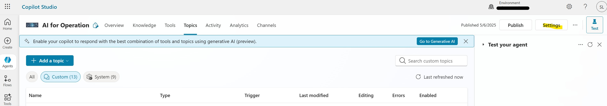

<h3>Microsoft Azure AI for Operation Framework Cipolot Agent</h3>

 <h2>Prerequisites</h2>
 

Required licenses:
 - Copilot Studio Developer Licenses (Microsoft 365 Copilot Studio) | 1 * Developer
 - Power Automate Premium | 1 * User
 - Microsoft Teams | 1* User

Required Solution:
- Copilot Studio Agent

<h2>Copilot Studio creation</h2>
 
Before proceeding with Copilot Studio Agent creation, ensure to have assigned the required Copilot Studio Developer Licenses in <a href="https://admin.microsoft.com/#/homepage">"Microsoft 365 Admin Center"</a>. After that continue with the agent creation.

Open <a href="https://copilotstudio.microsoft.com/">"Microsoft Copilot Studio Portal"</a>. Click on New Agent: 

In the top right corner, click on Skip to configure:

In this page fill all required sections and then click on create:

Disable the GenAI orchestration clicking on Settings and set No:

At this point the new agent has been created. On the headers click on Topic, and then add topic :

From blank

Follow the istructions below:

**Solution Name** | **Information** | **Configuration** |
| ------------- | ------------- | ------------- |
| Copilot topic Update Manager | Topic used to integrate Update Manager with Copilot Studio | [Configuration Link](./Arc-SQL%20BPA/README.md) |
| Copilot topic FinOps | Topic used to integrate FinOps to Copilot Studio | [Configuration Link](./UpdateManagement/README.md) |
| Copilot topic SQL BPA | Topic used to integrate SQL BPA to Copilot Studio | [Configuration Link](./CostMonthlyCheck/README.md) |

 
