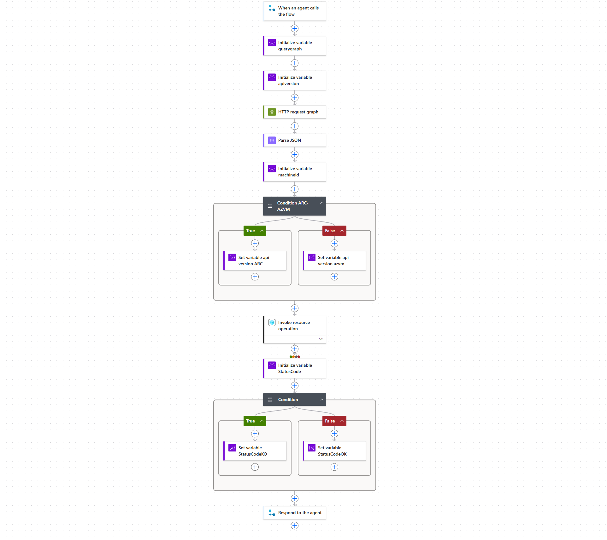

<h3>Azure UpdateManager Copilot Studio Flow - OneTimeUpdate</h3>
 


Click on "+" and create "Initialize Variable" :


Call the variable "querygraph", set it as a String and past the following query as a value:

```querygraph
resources
| where name =~ "@{triggerBody()?['text']}"
```

Click again on "+" and select again "Initialize Variable", call it "apiversion" :


After the variables creation place an "HTTP request" block and fill all the required information:


After HTTP request creation place and Parse JSON block and use the "body" output as a content.


Copy and past the schema:

```schema
{
    "properties": {
        "extendedLocation": {},
        "id": {
            "type": "string"
        },
        "identity": {},
        "kind": {
            "type": "string"
        },
        "location": {
            "type": "string"
        },
        "managedBy": {
            "type": "string"
        },
        "name": {
            "type": "string"
        },
        "plan": {},
        "properties": {
            "properties": {
                "classifications": {
                    "items": {
                        "type": "string"
                    },
                    "type": "array"
                },
                "kbId": {
                    "type": "string"
                },
                "lastModifiedDateTime": {
                    "type": "string"
                },
                "patchId": {
                    "type": "string"
                },
                "patchName": {
                    "type": "string"
                },
                "publishedDateTime": {
                    "type": "string"
                },
                "rebootBehavior": {
                    "type": "string"
                }
            },
            "type": "object"
        },
        "resourceGroup": {
            "type": "string"
        },
        "sku": {},
        "subscriptionId": {
            "type": "string"
        },
        "tags": {},
        "tenantId": {
            "type": "string"
        },
        "type": {
            "type": "string"
        },
        "zones": {}
    },
    "type": "object"
}
```

Now we need to create a "machineid" variable, paste the code below inside the value :


```function
body('Parse_JSON')?['data']?[0]?['id']
```

Create a condition block:


In the false section set the variable "api version azmv" following the example:


In the True section set the variable "api version ARC" following the example:


Create invoke resource operation and fill the required parameters following the example:


```code
Subscritpion: body('Parse_JSON')?['data']?[0]?['subscriptionId']
Resource Group: body('Parse_JSON')?['data']?[0]?['resourceGroup']
Resource Provider: first(split(body('Parse_JSON')?['data']?[0]?['type'], '/'))
Short Resource ID: machines/@{triggerBody()?['text']}
Client Api Version: @{variables('apiversion')}
Action name: installPatches

Body:
{
  "maximumDuration": "PT120M",
  "rebootSetting": "IfRequired",
  "windowsParameters": {
    "classificationsToInclude": [
      "Security",
      "UpdateRollup",
      "FeaturePack",
      "ServicePack",
      "Critical",
      "Definition",
      "Tools",
      "Updates"
    ]
  }
}
```
Now we need to create a "StatusCode" variable :


Create a condition block:


In the false section set the variable "StatusCode" following the example:


In the True section set the variable "StatusCode" following the example:


Finally we can paste the output to Copilot Agent:


As a final step, save and publish the flow. The entire logic flow must appear like that:



Go back to continue [Configuration Link](../../README.md#flow3)

