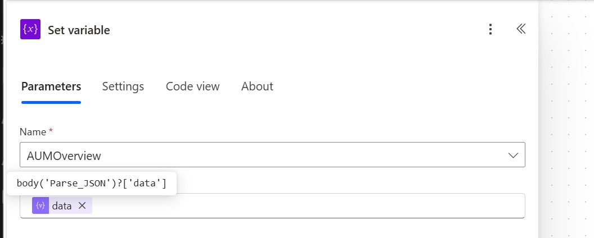
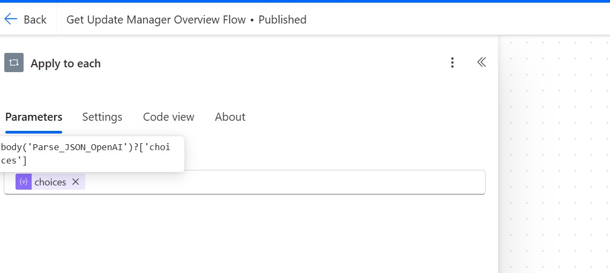

<h3>Azure UpdateManager Copilot Studio Topic</h3>
 
| **Parameters** | **Information** | **Note** |
| ------------- | ------------- | ------------- |
| Call OpenAI Endpoint| The URL of your openAI endpoint | You can found the value inside the OpenAI resource inside Azure Cognitive Service |
| api-key | The API code for manage your OpenAI service | The parameter is inside the second "Initialize Variable". Put your question in the "value" attribute  |

<h3> Deployment and Result </h3>

Click on the three dots and then Open code editor:


Copy and paste the code below and then click Save:<br>
```code
kind: AdaptiveDialog
modelDescription: Help me with Azure Update Manager, or orchestrate patching and AUM
beginDialog:
  kind: OnRecognizedIntent
  id: main
  intent:
    triggerQueries:
      - AUM
      - Azure Update Manager
 
  actions:
    - kind: Question
      id: question_YTqKbG
      interruptionPolicy:
        allowInterruption: true
 
      variable: init:Topic.UMChoise
      prompt: Do you want a general overview or view a specific server update status?
      entity:
        kind: EmbeddedEntity
        definition:
          kind: ClosedListEntity
          items:
            - id: General Overview
              displayName: General Overview
 
            - id: Single Server
              displayName: Single Server
 
    - kind: ConditionGroup
      id: conditionGroup_uvZHXF
      conditions:
        - id: conditionItem_tbxfED
          condition: =Topic.UMChoise = 'crc7c_agent.topic.AIforOPSAUM.main.question_YTqKbG'.'General Overview'
          actions:
            - kind: HttpRequestAction
              id: Qpgspk
              displayName: Call OpenAI Endpoint
              method: Post
              url: set-OpenAI-Endpoint
              headers:
                api-key: replace
                Content-Type: application/json
 
              body:
                kind: JsonRequestContent
                content: |
                  ={
                    messages: [
                      {
                        content: "You are a Azure Update Manager Administrator.Respond with a list",
                        role: "user"
                      },
                      {
                        content: Topic.graphresult,
                        role: "user"
                      }
                    ],
                    max_completion_tokens: 2000,
                    model: "o3-mini"
                  }
 
              response: Global.OpenAIOutput
              responseSchema: Any
 
            - kind: SendActivity
              id: sendActivity_HliD4h
              activity: "{Text(Index(Global.OpenAIOutput.choices, 1).message.content)}"
 
      elseActions:
        - kind: Question
          id: question_zoIoxC
          displayName: Question single server
          interruptionPolicy:
            allowInterruption: true
 
          alwaysPrompt: false
          variable: init:Topic.servername
          prompt: What is the server Name?
          entity: StringPrebuiltEntity
 
        - kind: SearchAndSummarizeContent
          id: nTBuGR
          userInput: =Topic.umstatusserver
          additionalInstructions: |-
            Describe the pending updates using this output:
            {Topic.umstatusserver}
 
        - kind: Question
          id: question_kbxpDC
          interruptionPolicy:
            allowInterruption: true
 
          variable: init:Topic.onetimeupdate
          prompt: How do you wont to procede?
          entity:
            kind: EmbeddedEntity
            definition:
              kind: ClosedListEntity
              items:
                - id: OneTimeUpdate
                  displayName: OneTimeUpdate
 
                - id: No Action
                  displayName: No Action
 
        - kind: ConditionGroup
          id: conditionGroup_WAEKbe
          conditions:
            - id: conditionItem_BIHv5a
              condition: =Topic.onetimeupdate = 'crc7c_agent.topic.AIforOPSAUM.main.question_kbxpDC'.OneTimeUpdate
              actions:
                - kind: SearchAndSummarizeContent
                  id: IHw6za
                  userInput: =Topic.UpdateStatus
                  additionalInstructions: |-
                    {Topic.UpdateStatus} = 200 means update in Running, else an error occurred with the update. If the value is 200 remember to customer to check on Azure Update Manager, else ask to customer to check user permissions only on Azure. Avoid any other information relatad WSUS and so on. Follow the example below:
                    - {Topic.UpdateStatus} = 200 : "The Update is in Progress."
                    - {Topic.UpdateStatus} = 403 : "Action denied. Check User Permissions."
 
          elseActions:
            - kind: SendActivity
              id: sendActivity_DXGYYd
              activity: OK no action
 
    - kind: Question
      id: question_CYQnuk
      interruptionPolicy:
        allowInterruption: true
 
      variable: init:Topic.EndConversation
      prompt: Do you want further help?
      entity:
        kind: EmbeddedEntity
        definition:
          kind: ClosedListEntity
          items:
            - id: Yes
              displayName: Yes
 
            - id: No
              displayName: No
 
    - kind: ConditionGroup
      id: conditionGroup_Z0kVKo
      conditions:
        - id: conditionItem_dcSLGm
          condition: =Topic.EndConversation = 'crc7c_agent.topic.AIforOPSAUM.main.question_CYQnuk'.Yes
          actions:
            - kind: SendActivity
              id: sendActivity_qH5K0e
              activity: OK
 
            - kind: GotoAction
              id: Q7f71L
              actionId: question_YTqKbG
 
      elseActions:
        - kind: BeginDialog
          id: sErToI
          dialog: crc7c_agent.topic.EndofConversation
 
inputType: {}
outputType: {}
```

When the topic is created, set the UMChoise Variable inside the question block:


Check the UMChoise condition in the left branch of the parallelism:


Now after UMChoise Condition, create new flow:


Click on "+" and create "Initialize Variable":


Set properties end past the following query:


```querygraph
((resources
| where type =~ "microsoft.compute/virtualmachines"
| where properties.storageProfile.osDisk.osType in~ ('Linux','Windows')
| extend conf = iff(properties.storageProfile.osDisk.osType =~ "windows", properties.osProfile.windowsConfiguration.patchSettings.patchMode, properties.osProfile.linuxConfiguration.patchSettings.patchMode)
| extend os = tolower(tostring(properties.storageProfile.osDisk.osType))
| extend id=tolower(id)
| extend status=properties.extended.instanceView.powerState.displayStatus
| extend imageRef = strcat(tolower(tostring(properties.storageProfile.imageReference.publisher)), ":", tolower(tostring(properties.storageProfile.imageReference.offer)), ":", tolower(tostring(properties.storageProfile.imageReference.sku)))
| extend isMarketplaceUnsupportedImageUsed = (isnotempty(properties.storageProfile.imageReference.publisher) and isnotempty(properties.storageProfile.imageReference.offer) and isnotempty(properties.storageProfile.imageReference.sku)) and
    not(iff(os =~ "windows",
        not(imageRef matches regex 'center-for-internet-security-inc:cis-windows-server:cis-windows-server-l.*-azure-observability') and
        (imageRef in ('center-for-internet-security-inc:cis-windows-server-2019-v1-0-0-l2:cis-ws2019-l2','center-for-internet-security-inc:cis-windows-server:cis-windows-server2019-l1-gen1','center-for-internet-security-inc:cis-windows-server:cis-windows-server2022-l1-gen1','center-for-internet-security-inc:cis-windows-server:cis-windows-server2022-l1-gen2','center-for-internet-security-inc:cis-windows-server:cis-windows-server2022-l2-gen2','center-for-internet-security-inc:cis-windows-server-2022-l2:cis-windows-server-2022-l2-gen2','microsoftwindowsserver:windowsserver:2008-r2-sp1','microsoftwindowsserver:windowsserver:2012-r2-datacenter','microsoftwindowsserver:windowsserver:2012-r2-datacenter-gensecond','microsoftwindowsserver:windowsserver:2012-r2-datacenter-smalldisk','microsoftwindowsserver:windowsserver:2012-r2-datacenter-smalldisk-g2','microsoftwindowsserver:windowsserver:2016-datacenter','microsoftwindowsserver:windowsserver:2016-datacenter-gensecond','microsoftwindowsserver:windowsserver:2016-datacenter-server-core','microsoftwindowsserver:windowsserver:2016-datacenter-smalldisk','microsoftwindowsserver:windowsserver:2016-datacenter-with-containers','microsoftwindowsserver:windowsserver:2019-datacenter','microsoftwindowsserver:windowsserver:2019-datacenter-core','microsoftwindowsserver:windowsserver:2019-datacenter-gensecond','microsoftwindowsserver:windowsserver:2019-datacenter-smalldisk','microsoftwindowsserver:windowsserver:2019-datacenter-smalldisk-g2','microsoftwindowsserver:windowsserver:2019-datacenter-with-containers','microsoftwindowsserver:windowsserver:2022-datacenter','microsoftwindowsserver:windowsserver:2022-datacenter-azure-edition','microsoftwindowsserver:windowsserver:2022-datacenter-azure-edition-core','microsoftwindowsserver:windowsserver:2022-datacenter-azure-edition-core-smalldisk','microsoftwindowsserver:windowsserver:2022-datacenter-azure-edition-hotpatch','microsoftwindowsserver:windowsserver:2022-datacenter-azure-edition-hotpatch-smalldisk','microsoftwindowsserver:windowsserver:2022-datacenter-azure-edition-smalldisk','microsoftwindowsserver:windowsserver:2022-datacenter-core','microsoftwindowsserver:windowsserver:2022-datacenter-core-g2','microsoftwindowsserver:windowsserver:2022-datacenter-g2','microsoftwindowsserver:windowsserver:2022-datacenter-smalldisk','microsoftwindowsserver:windowsserver:2022-datacenter-smalldisk-g2','microsoftwindowsserver:microsoftserveroperatingsystems-previews:windows-server-2025-azure-edition-hotpatch','microsoftwindowsserver:windowsserver:2025-datacenter-azure-edition','microsoftwindowsserver:windowsserver:2025-datacenter-azure-edition-core','microsoftwindowsserver:windowsserver:2025-datacenter-azure-edition-core-smalldisk','microsoftwindowsserver:windowsserver:2025-datacenter-azure-edition-smalldisk','microsoftazuresiterecovery:process-server:windows-2012-r2-datacenter','microsoftdynamicsax:dynamics:pre-req-ax7-onebox-v4','microsoftdynamicsax:dynamics:pre-req-ax7-onebox-v5','microsoftdynamicsax:dynamics:pre-req-ax7-onebox-v6','microsoftdynamicsax:dynamics:pre-req-ax7-onebox-v7','microsoftdynamicsax:dynamics:pre-req-ax7-onebox-u8','microsoftsqlserver:sql2016sp1-ws2016:standard','microsoftsqlserver:sql2016sp2-ws2016:standard','microsoftsqlserver:sql2017-ws2016:enterprise','microsoftsqlserver:sql2017-ws2016:standard','microsoftsqlserver:sql2019-ws2019:enterprise','microsoftsqlserver:sql2019-ws2019:sqldev','microsoftsqlserver:sql2019-ws2019:standard','microsoftsqlserver:sql2019-ws2019:standard-gen2','bissantechnology1583581147809:bissan_secure_windows_server2019:secureserver2019','center-for-internet-security-inc:cis-windows-server-2016-v1-0-0-l1:cis-ws2016-l1','center-for-internet-security-inc:cis-windows-server-2016-v1-0-0-l2:cis-ws2016-l2','center-for-internet-security-inc:cis-windows-server-2019-v1-0-0-l1:cis-ws2019-l1','center-for-internet-security-inc:cis-win-2016-stig:cis-win-2016-stig','center-for-internet-security-inc:cis-win-2019-stig:cis-win-2019-stig','center-for-internet-security-inc:cis-windows-server:cis-windows-server2019-stig-gen1','center-for-internet-security-inc:cis-windows-server-2012-r2-v2-2-1-l1:cis-ws2012-r2-l1','center-for-internet-security-inc:cis-windows-server-2012-r2-v2-2-1-l2:cis-ws2012-r2-l2','center-for-internet-security-inc:cis-windows-server-2012-v2-0-1-l2:cis-ws2012-l2','cloud-infrastructure-services:servercore-2019:servercore-2019','cloud-infrastructure-services:hpc2019-windows-server-2019:hpc2019-windows-server-2019','cognosys:sql-server-2016-sp2-std-win2016-debug-utilities:sql-server-2016-sp2-std-win2016-debug-utilities','cloud-infrastructure-services:ad-dc-2016:ad-dc-2016','cloud-infrastructure-services:ad-dc-2019:ad-dc-2019','cloud-infrastructure-services:ad-dc-2022:ad-dc-2022','cloud-infrastructure-services:sftp-2016:sftp-2016','cloud-infrastructure-services:rds-farm-2019:rds-farm-2019','cloud-infrastructure-services:hmailserver:hmailserver-email-server-2016','ntegralinc1586961136942:ntg_windows_datacenter_2019:ntg_windows_server_2019','outsystems:os11-vm-baseimage:lifetime','outsystems:os11-vm-baseimage:platformserver','tidalmediainc:windows-server-2022-datacenter:windows-server-2022-datacenter','veeam:office365backup:veeamoffice365backup','microsoftdynamicsnav:dynamicsnav:2017','microsoftwindowsserver:windowsserver-hub:2012-r2-datacenter-hub','microsoftwindowsserver:windowsserver-hub:2016-datacenter-hub','aod:win2019azpolicy:win2019azpolicy') or imageRef matches regex 'microsoftwindowsserver:windowsserver:.*|microsoftbiztalkserver:biztalk-server:.*|microsoftdynamicsax:dynamics:.*|microsoftpowerbi:.*:.*|microsoftsharepoint:microsoftsharepointserver:.*|microsoftsqlserver:.*:.*|microsoftvisualstudio:visualstudio.*:.*-ws2012r2|microsoftvisualstudio:visualstudio.*:.*-ws2016|microsoftvisualstudio:visualstudio.*:.*-ws2019|microsoftvisualstudio:visualstudio.*:.*-ws2022|microsoftwindowsserver:windows-cvm:.*|microsoftwindowsserver:windowsserverdotnet:.*|microsoftwindowsserver:windowsserver-gen2preview:.*|microsoftwindowsserver:windowsserversemiannual:.*|microsoftwindowsserver:windowsserverupgrade:.*|microsoftwindowsserverhpcpack:windowsserverhpcpack:.*|microsoft-dsvm:dsvm-windows:.*|microsoft-dsvm:dsvm-win-2019:.*|microsoft-dsvm:dsvm-win-2022:.*|center-for-internet-security-inc:cis-windows-server:cis-windows-server2016-l.*|center-for-internet-security-inc:cis-windows-server:cis-windows-server2019-l.*|center-for-internet-security-inc:cis-windows-server:cis-windows-server2022-l.*|center-for-internet-security-inc:cis-windows-server-2022-l1:.*|center-for-internet-security-inc:cis-windows-server-2022-l2:.*|microsoft-ads:windows-data-science-vm:.*|filemagellc:filemage-gateway-vm-win:filemage-gateway-vm-win-.*|esri:arcgis-enterprise.*:byol.*|esri:pro-byol:pro-byol-.*|veeam:veeam-backup-replication:veeam-backup-replication-v.*|southrivertech1586314123192:tn-ent-payg:tnentpayg.*|belindaczsro1588885355210:belvmsrv.*:belvmsrv.*|southrivertech1586314123192:tn-sftp-payg:tnsftppayg.*'),
        not(imageRef in ('redhat:rhel-ha:81_gen2') or imageRef matches regex 'openlogic:centos:8.*|openlogic:centos-hpc:.*|microsoftsqlserver:sql2019-sles.*:.*|microsoftsqlserver:sql2019-rhel7:.*|microsoftsqlserver:sql2017-rhel7:.*|microsoft-ads:.*:.*') and
            (imageRef in ('almalinux:almalinux-hpc:8-hpc-gen2','almalinux:almalinux-hpc:8_5-hpc','almalinux:almalinux-hpc:8_5-hpc-gen2','almalinux:almalinux-hpc:8_6-hpc','almalinux:almalinux-hpc:8_6-hpc-gen2','almalinux:almalinux-hpc:8_7-hpc-gen1','almalinux:almalinux-hpc:8_7-hpc-gen2','almalinux:almalinux-hpc:8_10-hpc-gen1','almalinux:almalinux-hpc:8_10-hpc-gen2','canonical:ubuntuserver:16.04-lts','canonical:ubuntuserver:16.04.0-lts','canonical:ubuntuserver:18.04-lts','canonical:ubuntuserver:18_04-lts-arm64','canonical:ubuntuserver:18_04-lts-gen2','canonical:0001-com-ubuntu-confidential-vm-focal:20_04-lts-cvm','canonical:0001-com-ubuntu-confidential-vm-jammy:22_04-lts-cvm','canonical:0001-com-ubuntu-pro-bionic:pro-18_04-lts','canonical:0001-com-ubuntu-pro-focal:pro-20_04-lts','canonical:0001-com-ubuntu-pro-focal:pro-20_04-lts-gen2','canonical:0001-com-ubuntu-pro-jammy:pro-22_04-lts-gen2','canonical:0001-com-ubuntu-server-focal:20_04-lts','canonical:0001-com-ubuntu-server-focal:20_04-lts-gen2','canonical:0001-com-ubuntu-server-focal:20_04-lts-arm64','canonical:0001-com-ubuntu-server-jammy:22_04-lts','canonical:0001-com-ubuntu-server-jammy:22_04-lts-arm64','canonical:0001-com-ubuntu-server-jammy:22_04-lts-gen2','center-for-internet-security-inc:cis-rhel-7-v2-2-0-l1:cis-redhat7-l1','center-for-internet-security-inc:cis-rhel:cis-redhat7-l2-gen1','center-for-internet-security-inc:cis-rhel:cis-redhat8-l1-gen2','center-for-internet-security-inc:cis-rhel:cis-redhat8-l1-gen1','center-for-internet-security-inc:cis-rhel:cis-redhat8-l2-gen1','center-for-internet-security-inc:cis-rhel:cis-redhat9-l1-gen2','center-for-internet-security-inc:cis-rhel:cis-redhat9-l2-gen2','center-for-internet-security-inc:cis-ubuntu-linux-2004-l1:cis-ubuntu-linux-2004-l1','center-for-internet-security-inc:cis-ubuntu-linux-2204-l1:cis-ubuntu-linux-2204-l1','center-for-internet-security-inc:cis-ubuntu:cis-ubuntulinux2004-l1-gen1','center-for-internet-security-inc:cis-ubuntu:cis-ubuntulinux2204-l1-gen2','microsoftcblmariner:cbl-mariner:cbl-mariner-1','microsoftcblmariner:cbl-mariner:1-gen2','microsoftcblmariner:cbl-mariner:cbl-mariner-2','microsoftcblmariner:cbl-mariner:cbl-mariner-2-arm64','microsoftcblmariner:cbl-mariner:cbl-mariner-2-gen2','microsoftcblmariner:cbl-mariner:cbl-mariner-2-gen2-fips','microsoft-aks:aks:aks-engine-ubuntu-1804-202112','microsoft-dsvm:aml-workstation:ubuntu-20','microsoft-dsvm:aml-workstation:ubuntu-20-gen2','microsoft-dsvm:ubuntu-hpc:1804','microsoft-dsvm:ubuntu-hpc:1804-ncv4','microsoft-dsvm:ubuntu-hpc:2004','microsoft-dsvm:ubuntu-hpc:2004-preview-ndv5','microsoft-dsvm:ubuntu-hpc:2204','microsoft-dsvm:ubuntu-hpc:2204-preview-ndv5','openlogic:centos:7.2','openlogic:centos:7.3','openlogic:centos:7.4','openlogic:centos:7.5','openlogic:centos:7.6','openlogic:centos:7.7','openlogic:centos:7_8','openlogic:centos:7_9','openlogic:centos:7_9-gen2','openlogic:centos:8.0','openlogic:centos:8_1','openlogic:centos:8_2','openlogic:centos:8_3','openlogic:centos:8_4','openlogic:centos:8_5','openlogic:centos-lvm:7-lvm','openlogic:centos-lvm:8-lvm','redhat:rhel:7.2','redhat:rhel:7.3','redhat:rhel:7.4','redhat:rhel:7.5','redhat:rhel:7.6','redhat:rhel:7.7','redhat:rhel:7.8','redhat:rhel:7_9','redhat:rhel:7-lvm','redhat:rhel:7-raw','redhat:rhel:8','redhat:rhel:8.1','redhat:rhel:81gen2','redhat:rhel:8.2','redhat:rhel:82gen2','redhat:rhel:8_3','redhat:rhel:83-gen2','redhat:rhel:8_4','redhat:rhel:84-gen2','redhat:rhel:8_5','redhat:rhel:85-gen2','redhat:rhel:8_6','redhat:rhel:86-gen2','redhat:rhel:8_7','redhat:rhel:8_8','redhat:rhel:8-lvm','redhat:rhel:8-lvm-gen2','redhat:rhel-raw:8-raw','redhat:rhel-raw:8-raw-gen2','redhat:rhel:9_0','redhat:rhel:9_1','redhat:rhel:9-lvm','redhat:rhel:9-lvm-gen2','redhat:rhel-arm64:8_6-arm64','redhat:rhel-arm64:9_0-arm64','redhat:rhel-arm64:9_1-arm64','suse:sles-12-sp5:gen1','suse:sles-12-sp5:gen2','suse:sles-15-sp2:gen1','suse:sles-15-sp2:gen2','almalinux:almalinux-x86_64:8_7-gen2','aviatrix-systems:aviatrix-bundle-payg:aviatrix-enterprise-bundle-byol','aviatrix-systems:aviatrix-copilot:avx-cplt-byol-01','aviatrix-systems:aviatrix-copilot:avx-cplt-byol-02','aviatrix-systems:aviatrix-companion-gateway-v9:aviatrix-companion-gateway-v9','aviatrix-systems:aviatrix-companion-gateway-v10:aviatrix-companion-gateway-v10','aviatrix-systems:aviatrix-companion-gateway-v10:aviatrix-companion-gateway-v10u','aviatrix-systems:aviatrix-companion-gateway-v12:aviatrix-companion-gateway-v12','aviatrix-systems:aviatrix-companion-gateway-v13:aviatrix-companion-gateway-v13','aviatrix-systems:aviatrix-companion-gateway-v13:aviatrix-companion-gateway-v13u','aviatrix-systems:aviatrix-companion-gateway-v14:aviatrix-companion-gateway-v14','aviatrix-systems:aviatrix-companion-gateway-v14:aviatrix-companion-gateway-v14u','aviatrix-systems:aviatrix-companion-gateway-v16:aviatrix-companion-gateway-v16','canonical:0001-com-ubuntu-pro-jammy:pro-22_04-lts','center-for-internet-security-inc:cis-rhel:cis-redhat7-l1-gen1','center-for-internet-security-inc:cis-rhel-7-v2-2-0-l1:cis-rhel7-l1','center-for-internet-security-inc:cis-rhel-7-stig:cis-rhel-7-stig','center-for-internet-security-inc:cis-rhel-7-l2:cis-rhel7-l2','center-for-internet-security-inc:cis-rhel-8-stig:cis-rhel-8-stig','center-for-internet-security-inc:cis-oracle:cis-oraclelinux8-l1-gen1','center-for-internet-security-inc:cis-oracle-linux-8-l1:cis-oracle8-l1','center-for-internet-security-inc:cis-ubuntu:cis-ubuntu1804-l1','center-for-internet-security-inc:cis-ubuntu-linux-1804-l1:cis-ubuntu1804-l1','center-for-internet-security-inc:cis-ubuntu-linux-2004-l1:cis-ubuntu2004-l1','center-for-internet-security-inc:cis-ubuntu-linux-2204-l1:cis-ubuntu-linux-2204-l1-gen2','cloud-infrastructure-services:dns-ubuntu-2004:dns-ubuntu-2004','cloud-infrastructure-services:gitlab-ce-ubuntu20-04:gitlab-ce-ubuntu-20-04','cloud-infrastructure-services:squid-ubuntu-2004:squid-ubuntu-2004','cloud-infrastructure-services:load-balancer-nginx:load-balancer-nginx','cloudera:cloudera-centos-os:7_5','cncf-upstream:capi:ubuntu-1804-gen1','cncf-upstream:capi:ubuntu-2004-gen1','cncf-upstream:capi:ubuntu-2204-gen1','cognosys:centos-77-free:centos-77-free','credativ:debian:8','credativ:debian:9','credativ:debian:9-backports','debian:debian-10:10','debian:debian-10:10-gen2','debian:debian-10:10-backports','debian:debian-10:10-backports-gen2','debian:debian-10-daily:10','debian:debian-10-daily:10-gen2','debian:debian-10-daily:10-backports','debian:debian-10-daily:10-backports-gen2','debian:debian-11:11','debian:debian-11:11-gen2','debian:debian-11:11-backports','debian:debian-11:11-backports-gen2','debian:debian-11-daily:11','debian:debian-11-daily:11-gen2','debian:debian-11-daily:11-backports','debian:debian-11-daily:11-backports-gen2','erockyenterprisesoftwarefoundationinc1653071250513:rockylinux:free','erockyenterprisesoftwarefoundationinc1653071250513:rockylinux-9:rockylinux-9','kali-linux:kali:kali-2024-3','github:github-enterprise:github-enterprise','matillion:matillion:matillion-etl-for-snowflake','microsoft-dsvm:aml-workstation:ubuntu','microsoft-dsvm:ubuntu-1804:1804-gen2','microsoft-dsvm:ubuntu-2004:2004','microsoft-dsvm:ubuntu-2004:2004-gen2','netapp:netapp-oncommand-cloud-manager:occm-byol','nginxinc:nginx-plus-ent-v1:nginx-plus-ent-centos7','ntegralinc1586961136942:ntg_oracle_8_7:ntg_oracle_8_7','ntegralinc1586961136942:ntg_ubuntu_20_04_lts:ntg_ubuntu_20_04_lts','openlogic:centos-hpc:7.1','openlogic:centos-hpc:7.3','oracle:oracle-linux:8','oracle:oracle-linux:8-ci','oracle:oracle-linux:81','oracle:oracle-linux:81-ci','oracle:oracle-linux:81-gen2','oracle:oracle-linux:ol82','oracle:oracle-linux:ol8_2-gen2','oracle:oracle-linux:ol82-gen2','oracle:oracle-linux:ol83-lvm','oracle:oracle-linux:ol83-lvm-gen2','oracle:oracle-linux:ol84-lvm','oracle:oracle-linux:ol84-lvm-gen2','procomputers:almalinux-8-7:almalinux-8-7','procomputers:rhel-8-2:rhel-8-2','procomputers:rhel-8-8-gen2:rhel-8-8-gen2','procomputers:rhel-8-9-gen2:rhel-8-9-gen2','rapid7:nexpose-scan-engine:nexpose-scan-engine','rapid7:rapid7-vm-console:rapid7-vm-console','redhat:rhel:89-gen2','redhat:rhel-byos:rhel-raw76','redhat:rhel-byos:rhel-lvm88','redhat:rhel-byos:rhel-lvm88-gen2','redhat:rhel-byos:rhel-lvm92','redhat:rhel-byos:rhel-lvm-92-gen2','redhat:rhel-ha:9_2','redhat:rhel-ha:9_2-gen2','redhat:rhel-sap-apps:9_0','redhat:rhel-sap-apps:90sapapps-gen2','redhat:rhel-sap-apps:9_2','redhat:rhel-sap-apps:92sapapps-gen2','redhat:rhel-sap-ha:9_2','redhat:rhel-sap-ha:92sapha-gen2','resf:rockylinux-x86_64:8-base','resf:rockylinux-x86_64:8-lvm','resf:rockylinux-x86_64:9-base','resf:rockylinux-x86_64:9-lvm','openlogic:centos-ci:7-ci','openlogic:centos-lvm:7-lvm-gen2','oracle:oracle-database:oracle_db_21','oracle:oracle-database-19-3:oracle-database-19-0904','redhat:rhel-sap-ha:90sapha-gen2','suse:sles:12-sp4-gen2','suse:sles:15','suse:sles-15-sp2-basic:gen2','suse:sles-15-sp2-hpc:gen2','suse:sles-15-sp3:gen2','suse:sles-15-sp4-sapcal:gen1','suse:sles-byos:12-sp4','suse:sles-byos:12-sp4-gen2','suse:sles-sap:12-sp4','suse:sles-sap:12-sp4-gen2','suse:sles-sap-15-sp3:gen2','suse:sles-sap-byos:12-sp4','suse:sles-sap-byos:12-sp4-gen2','suse:sles-sap-byos:gen2-12-sp4','suse:sles-sapcal:12-sp3','suse:sles-standard:12-sp4-gen2','suse:sles-sap-15-sp1-byos:gen1','suse:sles-sap-15-sp2-byos:gen2','suse:sles-sap-15-sp4-byos:gen1','talend:talend_re_image:tlnd_re','tenable:tenablecorewas:tenablecoreol8wasbyol','tenable:tenablecorenessus:tenablecorenessusbyol','thorntechnologiesllc:sftpgateway:sftpgateway','zscaler:zscaler-private-access:zpa-con-azure','cloudrichness:rockey_linux_image:rockylinux86','ntegralinc1586961136942:ntg_cbl_mariner_2:ntg_cbl_mariner_2_gen2','openvpn:openvpnas:access_server_byol','suse:sles:12-sp3','suse:sles-15-sp1-basic:gen1','suse:sles-15-sp2-basic:gen1','suse:sles-15-sp3-basic:gen1','suse:sles-15-sp3-basic:gen2','suse:sles-15-sp4-basic:gen2','suse:sles-sap:12-sp3','suse:sles-sap:15','suse:sles-sap:gen2-15','suse:sles-sap-byos:15') or imageRef matches regex 'almalinux:almalinux:8-gen.*|almalinux:almalinux-hpc:8-hpc-gen.*|almalinux:almalinux-hpc:8_5-hpc.*|almalinux:almalinux-hpc:8_7-hpc-gen.*|almalinux:almalinux-hpc:8_10-hpc-gen.*|almalinux:almalinux:9-gen.*|almalinux:almalinux-x86_64:8-gen.*|almalinux:almalinux-x86_64:9-gen.*|canonical:.*:.*|center-for-internet-security-inc:cis-rhel:cis-redhat7-l.*-gen1|center-for-internet-security-inc:cis-rhel:cis-redhat8-l.*-gen1|center-for-internet-security-inc:cis-rhel:cis-redhat8-l.*-gen2|center-for-internet-security-inc:cis-rhel:cis-redhat9-l.*-gen1|center-for-internet-security-inc:cis-rhel:cis-redhat9-l.*-gen2|center-for-internet-security-inc:cis-rhel-8-l.*:cis-rhel8-l.*|center-for-internet-security-inc:cis-rhel9-l1:cis-rhel9-l1.*|center-for-internet-security-inc:cis-oracle:cis-oraclelinux9-l1-gen.*|center-for-internet-security-inc:cis-ubuntu:cis-ubuntulinux2204-l1-gen.*|microsoftsqlserver:.*:.*|openlogic:centos:7.*|oracle:oracle-database-.*:18..*|oracle:oracle-linux:7.*|openlogic:centos:8.*|oracle:oracle-linux:ol7.*|oracle:oracle-linux:ol8.*|oracle:oracle-linux:ol9.*|redhat:rhel:7.*|redhat:rhel:8.*|redhat:rhel:9.*|redhat:rhel-byos:rhel-lvm7.*|redhat:rhel-byos:rhel-lvm8.*|redhat:rhel-ha:8.*|redhat:rhel-raw:7.*|redhat:rhel-raw:8.*|redhat:rhel-raw:9.*|redhat:rhel-sap:7.*|redhat:rhel-sap-apps:7.*|redhat:rhel-sap-apps:8.*|redhat:rhel-sap-.*:9_0|redhat:rhel-sap-ha:7.*|redhat:rhel-sap-ha:8.*|oracle:oracle-linux:ol9-lvm.*|suse:opensuse-leap-15-.*:gen.*|suse:sles-12-sp5-.*:gen.*|oracle:oracle-linux:ol9-lvm.*|suse:sles-sap-12-sp5.*:gen.*|suse:sles-sap-15-.*:gen.*|suse:sle-hpc-15-sp4:gen.*|suse:sles-15-sp1-sapcal:gen.*|suse:sles-15-sp3-sapcal:gen.*|suse:sles-15-sp4:gen.*|suse:sles-15-sp4-basic:gen.*|suse:sles-15-sp6.*:gen.*|suse:sle-hpc-15-sp4-byos:gen.*|suse:sle-hpc-15-sp5-byos:gen.*|suse:sle-hpc-15-sp5:gen.*|suse:sles-15-sp4-byos:gen.*|suse:sles-15-sp4-chost-byos:gen.*|suse:sles-15-sp4-hardened-byos:gen.*|suse:sles-15-sp5-basic:gen.*|suse:sles-15-sp5-byos:gen.*|suse:sles-15-sp5-chost-byos:gen.*|suse:sles-15-sp5-hardened-byos:gen.*|suse:sles-15-sp5-sapcal:gen.*|suse:sles-15-sp5:gen.*|suse:sles-sap-15-sp4-byos:gen.*|suse:sles-sap-15-sp4-hardened-byos:gen.*|suse:sles-sap-15-sp5-byos:gen.*|suse:sles-sap-15-sp5-hardened-byos:gen.*')))
| project id, name, os, type, conf, status, resourceProperties=properties, isMarketplaceUnsupportedImageUsed)
| union
(resources 
| where type =~ "microsoft.hybridcompute/machines"
| extend id=tolower(id)
| extend os=tolower(coalesce(tostring(properties.osName), tostring(properties.osType)))
| where os in~ ('Linux', 'Windows')
| extend status=properties.status
| extend isMarketplaceUnsupportedImageUsed = false
| project id, name, os, type, status, resourceProperties=properties, isMarketplaceUnsupportedImageUsed))
| join kind=leftouter(
    resources
    | where type in~ ("Microsoft.SqlVirtualMachine/sqlVirtualMachines", "microsoft.azurearcdata/sqlserverinstances")
    | project resourceId = iff(type =~ "Microsoft.SqlVirtualMachine/sqlVirtualMachines", tolower(properties.virtualMachineResourceId), tolower(properties.containerResourceId)), sqlType = type
    | summarize by resourceId, sqlType
) on $left.id == $right.resourceId
| extend type = iff(isnotempty(sqlType), sqlType, type)
| project-away sqlType, resourceId
| where type in~ ("microsoft.compute/virtualmachines", "microsoft.hybridcompute/machines", "microsoft.sqlvirtualmachine/sqlvirtualmachines", "microsoft.azurearcdata/sqlserverinstances") 
| join kind=leftouter
((patchassessmentresources
| where type in~ ("microsoft.compute/virtualmachines/patchassessmentresults", "microsoft.hybridcompute/machines/patchassessmentresults")
| where properties.status =~ "Succeeded" or properties.status =~ "Inprogress" or (isnotnull(properties.configurationStatus.vmGuestPatchReadiness.detectedVMGuestPatchSupportState) and (properties.configurationStatus.vmGuestPatchReadiness.detectedVMGuestPatchSupportState =~ "Unsupported"))
| parse id with resourceId "/patchAssessmentResults" *
| extend resourceId=tolower(resourceId)
| project resourceId, assessProperties=properties))
on $left.id == $right.resourceId
| extend isUnsupported = isMarketplaceUnsupportedImageUsed or (isnotnull(assessProperties.configurationStatus.vmGuestPatchReadiness.detectedVMGuestPatchSupportState) and (assessProperties.configurationStatus.vmGuestPatchReadiness.detectedVMGuestPatchSupportState =~ "Unsupported"))
| summarize
total = countif(1 == 1),
nodata = countif((isnull(assessProperties) == true and not(isUnsupported)) or assessProperties.status =~ "inprogress"),
pendingReboot = countif(isnotnull(assessProperties) and assessProperties.rebootPending == "true" and not(isUnsupported or assessProperties.status =~ "inprogress")),
pendingUpdatesWindows = countif(isnotnull(assessProperties) and assessProperties.osType =~ "Windows" and (assessProperties.availablePatchCountByClassification.critical>0 or assessProperties.availablePatchCountByClassification.security>0 or assessProperties.availablePatchCountByClassification.updateRollup>0 or assessProperties.availablePatchCountByClassification.featurePack>0 or assessProperties.availablePatchCountByClassification.servicePack>0 or assessProperties.availablePatchCountByClassification.definition>0 or assessProperties.availablePatchCountByClassification.tools>0 or assessProperties.availablePatchCountByClassification.updates>0) and not(isUnsupported or assessProperties.status =~ "inprogress")),
pendingUpdatesLinux = countif(isnotnull(assessProperties) and assessProperties.osType =~ "Linux" and (assessProperties.availablePatchCountByClassification.security>0 or assessProperties.availablePatchCountByClassification.other>0) and not(isUnsupported or assessProperties.status =~ "inprogress")),
noPendingUpdatesWindows = countif(isnotnull(assessProperties) and assessProperties.osType =~ "Windows" and (assessProperties.availablePatchCountByClassification.critical==0 and assessProperties.availablePatchCountByClassification.security==0 and assessProperties.availablePatchCountByClassification.updateRollup==0 and assessProperties.availablePatchCountByClassification.featurePack==0 and assessProperties.availablePatchCountByClassification.servicePack==0 and assessProperties.availablePatchCountByClassification.definition==0 and assessProperties.availablePatchCountByClassification.tools==0 and assessProperties.availablePatchCountByClassification.updates==0) and not(isUnsupported or assessProperties.status =~ "inprogress")),
noPendingUpdatesLinux = countif(isnotnull(assessProperties) and assessProperties.osType =~ "Linux" and (assessProperties.availablePatchCountByClassification.security==0 and assessProperties.availablePatchCountByClassification.other==0) and not(isUnsupported or assessProperties.status =~ "inprogress")),
unsupported = countif(isUnsupported and not(isnotnull(assessProperties) and assessProperties.status =~ "inprogress"))
```

Click again on "+" and select again "Initialize Variable":


After the variables creation place an "HTTP request" block and fill all the required information:


After HTTP request creation place and Parse JSON block and use the "body" output as a content.


Copy and past the schema:

```schema
{
    "type": "object",
    "properties": {
        "statusCode": {
            "type": "integer"
        },
        "headers": {
            "type": "object",
            "properties": {
                "Cache-Control": {
                    "type": "string"
                },
                "Pragma": {
                    "type": "string"
                },
                "Strict-Transport-Security": {
                    "type": "string"
                },
                "x-ms-correlation-request-id": {
                    "type": "string"
                },
                "x-ms-ratelimit-remaining-tenant-resource-requests": {
                    "type": "string"
                },
                "x-ms-user-quota-remaining": {
                    "type": "string"
                },
                "x-ms-user-quota-resets-after": {
                    "type": "string"
                },
                "x-ms-resource-graph-request-duration": {
                    "type": "string"
                },
                "x-ms-operation-identifier": {
                    "type": "string"
                },
                "x-ms-ratelimit-remaining-tenant-reads": {
                    "type": "string"
                },
                "x-ms-request-id": {
                    "type": "string"
                },
                "x-ms-routing-request-id": {
                    "type": "string"
                },
                "X-Content-Type-Options": {
                    "type": "string"
                },
                "X-Cache": {
                    "type": "string"
                },
                "X-MSEdge-Ref": {
                    "type": "string"
                },
                "Date": {
                    "type": "string"
                },
                "Content-Length": {
                    "type": "string"
                },
                "Content-Type": {
                    "type": "string"
                },
                "Expires": {
                    "type": "string"
                }
            }
        },
        "body": {
            "type": "object",
            "properties": {
                "totalRecords": {
                    "type": "integer"
                },
                "count": {
                    "type": "integer"
                },
                "data": {
                    "type": "array",
                    "items": {
                        "type": "object",
                        "properties": {
                            "total": {
                                "type": "integer"
                            },
                            "nodata": {
                                "type": "integer"
                            },
                            "pendingReboot": {
                                "type": "integer"
                            },
                            "pendingUpdatesWindows": {
                                "type": "integer"
                            },
                            "pendingUpdatesLinux": {
                                "type": "integer"
                            },
                            "noPendingUpdatesWindows": {
                                "type": "integer"
                            },
                            "noPendingUpdatesLinux": {
                                "type": "integer"
                            },
                            "unsupported": {
                                "type": "integer"
                            }
                        },
                        "required": [
                            "total",
                            "nodata",
                            "pendingReboot",
                            "pendingUpdatesWindows",
                            "pendingUpdatesLinux",
                            "noPendingUpdatesWindows",
                            "noPendingUpdatesLinux",
                            "unsupported"
                        ]
                    }
                },
                "facets": {
                    "type": "array"
                },
                "resultTruncated": {
                    "type": "string"
                }
            }
        }
    }
}
```

Now we need to set AUMOverview variable, create a "Set Variable" block :



Create another "HTTP Request" for OpenAI service:


After HTTP request for OpenAI creation, place an "Parse JSON" block and use the "body" output of HTTP request OpenAI as a content.


Copy and past the schema (Schema for OpenAI O3-mini model.If you use other model schema may change):

```schema
{
    "type": "object",
    "properties": {
        "statusCode": {
            "type": "integer"
        },
        "headers": {
            "type": "object",
            "properties": {
                "apim-request-id": {
                    "type": "string"
                },
                "Strict-Transport-Security": {
                    "type": "string"
                },
                "X-Content-Type-Options": {
                    "type": "string"
                },
                "x-ms-region": {
                    "type": "string"
                },
                "x-ratelimit-remaining-requests": {
                    "type": "string"
                },
                "x-ratelimit-limit-requests": {
                    "type": "string"
                },
                "x-ratelimit-remaining-tokens": {
                    "type": "string"
                },
                "x-ratelimit-limit-tokens": {
                    "type": "string"
                },
                "cmp-upstream-response-duration": {
                    "type": "string"
                },
                "x-accel-buffering": {
                    "type": "string"
                },
                "x-aml-cluster": {
                    "type": "string"
                },
                "x-envoy-upstream-service-time": {
                    "type": "string"
                },
                "x-ms-rai-invoked": {
                    "type": "string"
                },
                "X-Request-ID": {
                    "type": "string"
                },
                "ms-azureml-model-time": {
                    "type": "string"
                },
                "x-ms-client-request-id": {
                    "type": "string"
                },
                "azureml-model-session": {
                    "type": "string"
                },
                "x-ms-deployment-name": {
                    "type": "string"
                },
                "Date": {
                    "type": "string"
                },
                "Content-Length": {
                    "type": "string"
                },
                "Content-Type": {
                    "type": "string"
                }
            }
        },
        "body": {
            "type": "object",
            "properties": {
                "choices": {
                    "type": "array",
                    "items": {
                        "type": "object",
                        "properties": {
                            "content_filter_results": {
                                "type": "object",
                                "properties": {
                                    "hate": {
                                        "type": "object",
                                        "properties": {
                                            "filtered": {
                                                "type": "boolean"
                                            },
                                            "severity": {
                                                "type": "string"
                                            }
                                        }
                                    },
                                    "self_harm": {
                                        "type": "object",
                                        "properties": {
                                            "filtered": {
                                                "type": "boolean"
                                            },
                                            "severity": {
                                                "type": "string"
                                            }
                                        }
                                    },
                                    "sexual": {
                                        "type": "object",
                                        "properties": {
                                            "filtered": {
                                                "type": "boolean"
                                            },
                                            "severity": {
                                                "type": "string"
                                            }
                                        }
                                    },
                                    "violence": {
                                        "type": "object",
                                        "properties": {
                                            "filtered": {
                                                "type": "boolean"
                                            },
                                            "severity": {
                                                "type": "string"
                                            }
                                        }
                                    }
                                }
                            },
                            "finish_reason": {
                                "type": "string"
                            },
                            "index": {
                                "type": "integer"
                            },
                            "logprobs": {},
                            "message": {
                                "type": "object",
                                "properties": {
                                    "content": {
                                        "type": "string"
                                    },
                                    "refusal": {},
                                    "role": {
                                        "type": "string"
                                    }
                                }
                            }
                        },
                        "required": [
                            "content_filter_results",
                            "finish_reason",
                            "index",
                            "logprobs",
                            "message"
                        ]
                    }
                },
                "created": {
                    "type": "integer"
                },
                "id": {
                    "type": "string"
                },
                "model": {
                    "type": "string"
                },
                "object": {
                    "type": "string"
                },
                "prompt_filter_results": {
                    "type": "array",
                    "items": {
                        "type": "object",
                        "properties": {
                            "prompt_index": {
                                "type": "integer"
                            },
                            "content_filter_results": {
                                "type": "object",
                                "properties": {
                                    "hate": {
                                        "type": "object",
                                        "properties": {
                                            "filtered": {
                                                "type": "boolean"
                                            },
                                            "severity": {
                                                "type": "string"
                                            }
                                        }
                                    },
                                    "self_harm": {
                                        "type": "object",
                                        "properties": {
                                            "filtered": {
                                                "type": "boolean"
                                            },
                                            "severity": {
                                                "type": "string"
                                            }
                                        }
                                    },
                                    "sexual": {
                                        "type": "object",
                                        "properties": {
                                            "filtered": {
                                                "type": "boolean"
                                            },
                                            "severity": {
                                                "type": "string"
                                            }
                                        }
                                    },
                                    "violence": {
                                        "type": "object",
                                        "properties": {
                                            "filtered": {
                                                "type": "boolean"
                                            },
                                            "severity": {
                                                "type": "string"
                                            }
                                        }
                                    }
                                }
                            }
                        },
                        "required": [
                            "prompt_index",
                            "content_filter_results"
                        ]
                    }
                },
                "system_fingerprint": {
                    "type": "string"
                },
                "usage": {
                    "type": "object",
                    "properties": {
                        "completion_tokens": {
                            "type": "integer"
                        },
                        "completion_tokens_details": {
                            "type": "object",
                            "properties": {
                                "accepted_prediction_tokens": {
                                    "type": "integer"
                                },
                                "audio_tokens": {
                                    "type": "integer"
                                },
                                "reasoning_tokens": {
                                    "type": "integer"
                                },
                                "rejected_prediction_tokens": {
                                    "type": "integer"
                                }
                            }
                        },
                        "prompt_tokens": {
                            "type": "integer"
                        },
                        "prompt_tokens_details": {
                            "type": "object",
                            "properties": {
                                "audio_tokens": {
                                    "type": "integer"
                                },
                                "cached_tokens": {
                                    "type": "integer"
                                }
                            }
                        },
                        "total_tokens": {
                            "type": "integer"
                        }
                    }
                }
            }
        }
    }
}
```
Click again on "+" and select "Initialize Variable":


Now create an "Apply To Each" block, and ensure that the variable follow the images below:




Finally we can parse the output to Copilot Agent:


As a final step, save and publish the flow. The entire logic flow must appear like that:


