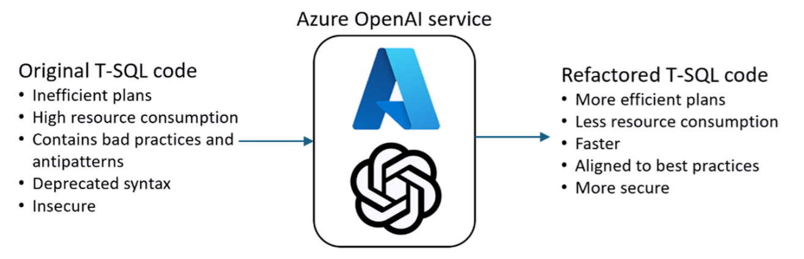
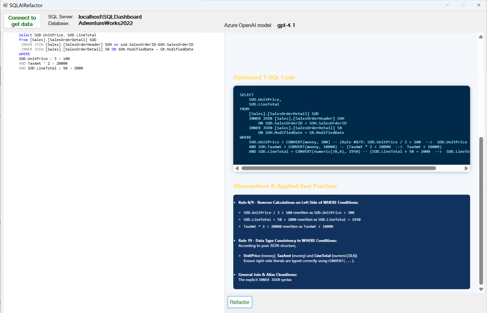
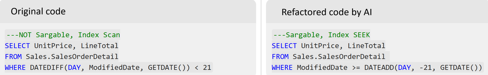

This repository is the accompanying code for the "AI-based T-SQL Refactoring: an automatic intelligent code optimization with Azure OpenAI" article. Make sure that check that out.

# SQLAIRefactor

**SQLAIRefactor** is a Windows Forms application that leverages Azure OpenAI to analyze and optimize T-SQL queries. It connects to your SQL Server database, extracts schema metadata in JSON format, and uses prompt engineering and large language models to refactor queries and apply SQL Server best practices automatically.

This solution is an AI-powered application to automating SQL Server code analysis and refactoring. The system intelligently identifies inefficiencies and common T-SQL anti-patterns, applying best practices through a set of formalized coding rules, using prompt-driven instructions. It not only automatically rewrites problematic and inefficient code but also delivers contextual recommendations to improve quality, security, and maintainability.

Designed to address real-world use cases, this soltion enables organizations to modernize and optimize their SQL workloads more efficiently, accelerating migrations and reducing manual effort in scenarios with large SQL codebases.
This technique can represent an advancement in SQL Server application development and maintenance, reducing manual effort and improving code quality and performance.

## 🚀 Features

- AI-powered SQL refactoring using GPT-4.1 or GPT-4o (Azure OpenAI)
- Retrieves and injects full table/column data types in JSON
- Identifies inefficiencies (e.g., implicit conversions, index scan vs. seek)
- Supports both Windows and SQL Authentication
- Renders results in an HTML-based view with syntax highlighting

---

## 📦 Prerequisites

- Windows OS
- [.NET Framework 4.8+](https://dotnet.microsoft.com/en-us/download/dotnet-framework)
- Azure OpenAI Resource (with `gpt-4.1`, `gpt-4o`, or `o3-mini` deployments)
- SQL Server with accessible schema

---

## 📄 License
This project is licensed under the MIT License.
